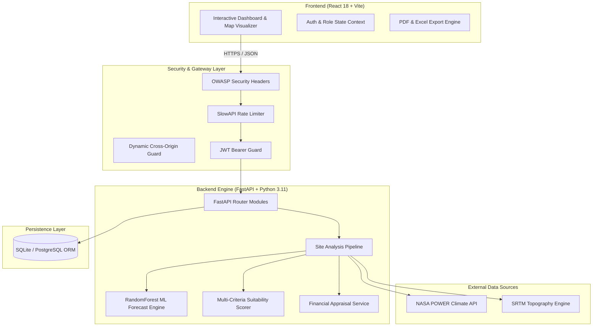

# AI Solar & Wind Deployment Intelligence Platform

[](https://www.python.org/)
[](https://fastapi.tiangolo.com/)
[](https://react.dev/)
[](https://vitejs.dev/)
[](#security-specifications)
[](LICENSE)

> An enterprise-grade, full-stack decision intelligence platform designed to eliminate pre-feasibility bottlenecks, automate multi-criteria spatial screening, predict annual energy yields via Machine Learning, and perform 25-year financial appraisals for utility-scale solar, wind, and hybrid renewable energy projects.

**Live Deployments & Endpoints**:
- **Live Web Platform**: [Solar & Wind Deployment Intelligence Platform](https://ai-solar-wind-deployment.vercel.app/)
- **Backend API Engine**: [https://solar-wind-deployment-api.onrender.com](https://solar-wind-deployment-api.onrender.com)
- **API Docs (Interactive Swagger)**: [https://solar-wind-deployment-api.onrender.com/docs](https://solar-wind-deployment-api.onrender.com/docs)

---

## The Problem

Developing utility-scale renewable energy infrastructure (Solar, Wind, and Hybrid BESS) is traditionally a **slow, fragmented, and capital-intensive process**:

1. **Protracted Site Assessment Timelines**: Pre-feasibility site evaluation typically takes **6 to 12 months** across disconnected teams—GIS specialists, climatologists, financial modelers, and environmental auditors.
2. **High Pre-Feasibility Risk & Capital Loss**: Misidentifying terrain slope (>15°), proximity to protected ecological buffers, logistics accessibility, or grid substation distances leads to **multi-million dollar project write-offs** and unexpected delays.
3. **Data Silos & Disconnected Tools**: GIS analysts work in desktop software (QGIS/ArcGIS), meteorologists rely on static spreadsheets, and executives evaluate financial risk in isolated models with zero real-time sync.
4. **Lack of Cross-Device Team Alignment**: Field analysts on mobile devices cannot seamlessly view or contribute to site assessments conducted by planners on desktop computers in real-time.

---

## Our Solution

The **AI Solar & Wind Deployment Intelligence Platform** provides a **unified, cloud-native single pane of glass** that reduces pre-feasibility evaluation timelines from **months to seconds**:

```
 ┌──────────────────────────────────────────────────────────────────────────┐
 │                          THE INTELLIGENCE ENGINE                         │
 ├──────────────────┬──────────────────┬──────────────────┬─────────────────┤
 │   Spatial MCDA │   NASA Climate  │   ML Power Model│   25-Yr Valuation│
 │   Constraint     │   Integration    │   RandomForest   │   NPV, IRR &    │
 │   Screening      │   (GHI & Wind)   │   12-Mo Curves   │   LCOE Appraisal│
 └──────────────────┴──────────────────┴──────────────────┴─────────────────┘
```

* **Instant Multi-Criteria Spatial Screening (MCDA)**: Evaluates terrain slope ($<15^\circ$), 150m river buffers, ecological reserves, settlement encroachment ($300\text{m}$), and substation distances within sub-3-second execution.
* **Live NASA POWER Agro-Climatology Integration**: Direct automated API querying of Global Horizontal Irradiance ($\text{GHI, kWh/m}^2/\text{day}$), 100m Hub-height Wind Velocity ($\text{m/s}$), Wind Power Density ($\text{W/m}^2$), Ambient Temperature, and Cloud Cover.
* **Ensemble Machine Learning Yield Forecasting**: Scikit-learn **RandomForest Regressor** trained on historical generation profiles to output 12-month generation curves, capacity factors ($\text{CF} \%$), and net annual output ($\text{MWh/GWh}$).
* **Automated 25-Year Investment Appraisal**: Instant computation of CAPEX, OPEX, PPA Tariff Revenue ($\text{INR } ₹/\text{kWh}$), 25-year Net Present Value (NPV), Internal Rate of Return (IRR %), Levelized Cost of Energy (LCOE), and Simple Payback Period.
* **Team Workspace Cloud Synchronization**: Shared search history (`/sites/recent`) and favorite site parcels (`/sites/saved`) synced in real-time across desktop laptops, tablets, and smartphones for all members belonging to the same **Team Workspace Code** (`organization_id`).

---

## Future Roadmap & Expansion Plans

Our engineering roadmap expands the platform into an end-to-end clean energy lifecycle management ecosystem:

- [ ] **Phase 1: Deep-Learning Satellite Auto-Detection (Q4 2026)**
  - Integrate Sentinel-2 & Landsat-9 high-resolution computer vision models to automatically detect existing transmission line towers, sub-station capacities, and transformer load margins.
- [ ] **Phase 2: Hybrid Battery Energy Storage System (BESS) Co-Location (Q1 2027)**
  - Add dispatch optimization algorithms for Solar + Storage and Wind + Storage co-located assets to simulate peak-shaving revenue and grid ancillary services arbitrage.
- [ ] **Phase 3: Multi-Region Carbon Credit & ESG Valuation Engine (Q2 2027)**
  - Automated calculation of carbon offset metrics ($\text{tCO}_2\text{e}$ avoided annually) and automated compliance reporting for Article 6 carbon credit markets and ESG disclosures.
- [ ] **Phase 4: Offline Mobile Field Survey Mode (Q3 2027)**
  - PWA offline field audit capability allowing surveyors to record ground-truth soil parameters, elevation profiles, and site photos on mobile devices with background DB sync upon connection.

---

## System Architecture



---

## Technology Stack

| Layer | Technologies Used |
| :--- | :--- |
| **Frontend UI** | React 18, Vite 5, Axios, Lucide Icons, 100% Cross-Device Responsive Vanilla CSS Design System |
| **Backend Framework** | Python 3.11, FastAPI 0.110, Uvicorn, Pydantic v2 |
| **Machine Learning** | Scikit-Learn (RandomForestRegressor), Pandas, NumPy, Joblib |
| **Security & Auth** | SlowAPI (Rate Limiter), PyJWT / Jose, Passlib (Bcrypt), Security Headers Middleware |
| **Database & ORM** | SQLite (Dev) / PostgreSQL (Prod), SQLAlchemy 2.0 ORM |
| **External APIs** | NASA POWER Agro-Climatology API, OpenStreetMap / Overpass GIS |

---

## Core Features & Technical Highlights

### Geographic & Spatial Intelligence
* **Coordinate-Driven Site Evaluation**: Real-time lat/lng site evaluation with interactive map visualizer, digital elevation modeling (SRTM), and slope calculation.
* **Exclusion Zone & Geofence Audit**: Automated screening against hard environmental constraints, protected areas, ecological buffers, and logistics route distances.

### Meteorological Integration Engine (NASA POWER)
* **Real-Time Data Fetching**: Retrieves Global Horizontal Irradiance (GHI, $\text{kWh/m}^2/\text{day}$), Peak Sun Hours, 100m Hub-height Wind Velocity ($\text{m/s}$), Wind Power Density ($\text{W/m}^2$), Ambient Temperature, and Cloud Cover.

### Machine Learning Energy Forecasting
* **Scikit-Learn RandomForest Pipeline**: Delivers 12-month seasonal generation curves, applied capacity factors (CF %), system efficiency losses, and annual net energy yields ($\text{MWh}$ / $\text{GWh}$).

### 25-Year Investment & Financial Appraisal Engine
* Automated valuation computing:
  * **CAPEX & OPEX** (Capital & Operational Expenditure in INR ₹)
  * **PPA Tariff Revenue** ($\text{INR } ₹/\text{kWh}$)
  * **Net Present Value (NPV)** over 25-year lifecycle
  * **Internal Rate of Return (IRR %)** & **Return on Investment (ROI %)**
  * **Levelized Cost of Energy (LCOE)** ($\text{INR } ₹/\text{kWh}$)
  * **Simple Payback Period** (Years)

### Team Workspace Cloud Synchronization
* **Workspace-Wide Data Sharing**: Recent search evaluations (`/sites/recent`) and saved favorite sites (`/sites/saved`) are persisted in the central database and automatically shared across all team members belonging to the same **Team Workspace Code** (`organization_id`).
* **Dynamic API Resolution**: Automatically resolves API base endpoints via `window.location.hostname`, supporting local network Wi-Fi IPs (`http://192.168.x.x:8000`) and live cloud deployments without hardcoded `localhost` dependencies.

### One-Click Engineering Reports & PDF Exports
* **1-Click Comprehensive Reporting**: Exports UTF-8 BOM 7-section CSV financial sheets and multi-page PDF engineering dossiers containing complete site metrics, financial matrices, and strategic AI recommendations.

---

## Quick Start Guide

### Prerequisites
- **Python**: `>= 3.11`
- **Node.js**: `>= 18.0.0`
- **npm**: `>= 9.0.0`

---

### 1. Backend Setup & Startup

```bash
# Navigate to backend directory
cd backend

# Create Python virtual environment
python -m venv ..\.venv

# Activate virtual environment (Windows PowerShell)
..\.venv\Scripts\Activate.ps1

# Install backend dependencies
pip install -r requirements.txt

# Seed default team workspace users, saved sites, and recent history
python scripts/seed_users.py

# Start FastAPI development server
uvicorn app.main:app --reload --host 0.0.0.0 --port 8000
```

The backend server will start at `http://localhost:8000`. API Swagger Interactive Documentation is available at `http://localhost:8000/docs`.

---

### 2. Frontend Setup & Startup

Open a new terminal window:

```bash
# Navigate to frontend directory
cd frontend

# Install Node.js dependencies
npm install

# Start Vite dev server
npm run dev
```

The frontend application will launch at `http://localhost:5173`.

---

## Default Demo Accounts

| Role | Username | Password | Team Code |
| :--- | :--- | :--- | :--- |
| **Administrator** | `shyam_nehra` | `password123` | `1001` |
| **Renewable Energy Planner** | `aishwarya_r` | `planner123` | `1001` |
| **GIS Analyst** | `gis_analyst` | `gis123` | `1001` |
| **Project Manager** | `rajesh_kumar` | `pm123` | `1001` |

---

## Security Specifications

- **Authentication Guard**: JWT Bearer tokens with 24-hour expiration (`HS256`).
- **Rate Limiting**:
  - `/auth/login`: 5 requests / min (prevents credential stuffing)
  - `/predictions/full-analysis`: 20 requests / min (prevents compute resource abuse)
  - General API: 120 requests / min
- **OWASP Security Headers**:
  - `X-Frame-Options: DENY` (anti-clickjacking)
  - `X-Content-Type-Options: nosniff` (MIME sniffing guard)
  - `Strict-Transport-Security` (HSTS)
  - `Content-Security-Policy` (CSP policy)
- **Input Sanitization**: Pydantic input length and coordinate range validation (Latitude: $-90^\circ$ to $+90^\circ$, Longitude: $-180^\circ$ to $+180^\circ$).

---

## Repository Structure

```
.
├── backend/
│   ├── app/
│   │   ├── api/             # REST Endpoints (auth, predictions, sites, saved_sites, recent_sites, projects)
│   │   ├── auth/            # Auth models, JWT security, RBAC dependencies
│   │   ├── core/            # Security headers & SlowAPI rate limiters
│   │   ├── database/        # SQLAlchemy engine & session setup
│   │   ├── evaluation/      # Scorer & spatial constraint evaluation engine
│   │   ├── models/          # ORM models (User, Site, SavedSite, RecentSite, Project, Predictions)
│   │   └── services/        # ML forecasting & financial appraisal services
│   ├── scripts/             # DB migration & seed scripts
│   ├── tests/               # Pytest integration & unit test suites
│   ├── requirements.txt     # Python dependency manifest
│   └── main.py              # FastAPI server entry point
├── frontend/
│   ├── src/
│   │   ├── api/             # Authenticated Axios client & API endpoints
│   │   ├── components/      # React components (SiteAnalysisScreen, Map, Compare)
│   │   ├── context/         # AuthContext state provider
│   │   └── App.jsx          # Route manager
│   └── package.json         # Node.js dependencies
└── README.md
```

---

## License

Distributed under the MIT License. See [`LICENSE`](LICENSE) for details.
