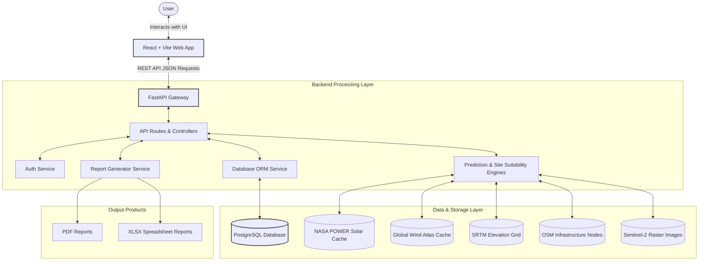

# Project Architecture Design

This document details the multi-tiered system architecture of the Solar & Wind Deployment Intelligence Platform.

---

## 1. System Layers

### Client Tier (Frontend)
- **Tech Stack**: React.js with Vite.
- **Role**: Renders maps, dashboard widgets, and user controls. Communicates asynchronously with the backend API.

### Interface Tier (FastAPI Gateway)
- **Tech Stack**: FastAPI, Uvicorn (ASGI server).
- **Role**: Exposes secure REST endpoints, validates inputs, handles routing, and automatically generates OpenAPI/Swagger documentation.

### Core Processing Tier (Backend)
- **Components**:
  - **Authentication Service**: Secures endpoint access using JWT tokens.
  - **Prediction Modules**: Processes solar irradiation and wind shear values.
  - **Site Suitability Engine**: Multi-criteria overlay analysis combining terrain, solar, wind, and distance weights.
  - **Report Generator**: Generates output summaries for users.

### Data Tier
- **Database**: PostgreSQL (relational storage for users, projects, candidates, suitability scores, and report metadata).
- **Data Layers**: Local cache structure of GeoTIFFs, JSON vectors, and CSV tables for environmental evaluations.
