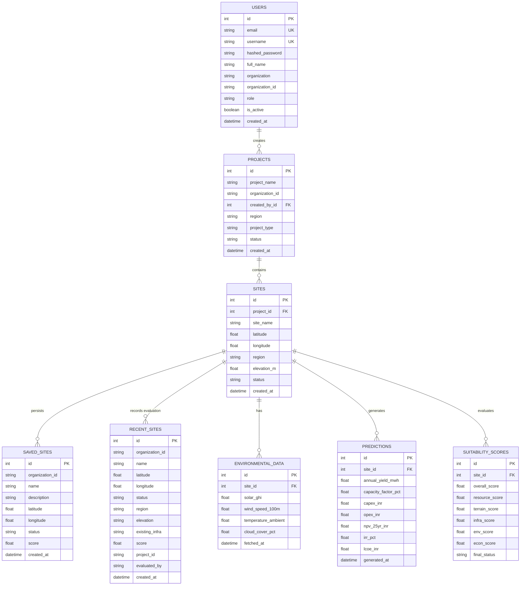

# Database Schema & Relational Design Document

## 1. Overview
The database layer uses **SQLAlchemy 2.0 ORM** supporting **SQLite** (local development) and **PostgreSQL** (production deployment).

---

## 2. Relational Entity Relationship (ER) Diagram

---

## 3. Detailed Data Dictionary

### 3.1 `users` Table
- `id` (INTEGER, Primary Key, Autoincrement)
- `email` (VARCHAR(120), Unique, Indexed, Not Null)
- `username` (VARCHAR(50), Unique, Indexed, Not Null)
- `hashed_password` (VARCHAR(255), Not Null)
- `full_name` (VARCHAR(100), Nullable)
- `organization` (VARCHAR(100), Nullable)
- `organization_id` (VARCHAR(50), Indexed, Default: "1001")
- `role` (VARCHAR(30), Default: "ENERGY_PLANNER")
- `is_active` (BOOLEAN, Default: True)
- `created_at` (TIMESTAMP, Default: UTC NOW)

### 3.2 `saved_sites` Table
- `id` (INTEGER, Primary Key, Autoincrement)
- `organization_id` (VARCHAR(50), Indexed, Not Null)
- `name` (VARCHAR(100), Not Null)
- `description` (VARCHAR(255), Nullable)
- `latitude` (FLOAT, Not Null)
- `longitude` (FLOAT, Not Null)
- `status` (VARCHAR(20), Not Null)
- `score` (FLOAT, Not Null)
- `created_at` (TIMESTAMP, Default: UTC NOW)

*Composite Index*: `idx_saved_sites_org_lat_lng` (`organization_id`, `latitude`, `longitude`) for fast workspace deduplication.

### 3.3 `recent_sites` Table
- `id` (INTEGER, Primary Key, Autoincrement)
- `organization_id` (VARCHAR(50), Indexed, Not Null)
- `name` (VARCHAR(200), Not Null)
- `latitude` (FLOAT, Not Null)
- `longitude` (FLOAT, Not Null)
- `status` (VARCHAR(50), Default: "EVALUATED")
- `region` (VARCHAR(100), Nullable)
- `elevation` (VARCHAR(100), Nullable)
- `existing_infra` (TEXT, Nullable)
- `score` (FLOAT, Nullable)
- `project_id` (VARCHAR(100), Nullable)
- `evaluated_by` (VARCHAR(100), Nullable)
- `created_at` (TIMESTAMP, Default: UTC NOW)

*Workspace History Index*: `idx_recent_sites_org_created` (`organization_id`, `created_at` DESC) for sub-millisecond team evaluation history retrieval.

---

## 4. Indexing Strategy & Spatial Optimizations

1. **Spatial Bounding Box Indexing**: Compound index on `(latitude, longitude)` enables sub-millisecond bounding box lookup for nearby sites.
2. **Workspace Isolation Indexing**: Index on `organization_id` enforces strict multi-tenant data isolation across workspace queries.