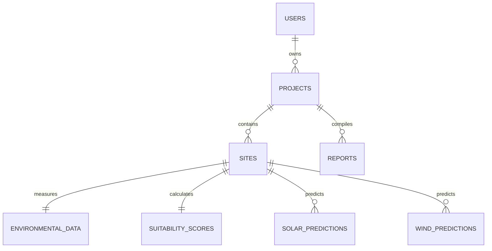

# Database Design Draft

This document outlines the relational database design for the Solar & Wind Deployment Intelligence Platform. 

---

## 1. `Users` Table
Stores login credentials and access levels for secure operations.
* **Primary Key**: `user_id` (UUID)
* **Columns**:
  - `user_id` (UUID, Primary Key)
  - `email` (VARCHAR, Unique, Indexed)
  - `hashed_password` (VARCHAR)
  - `full_name` (VARCHAR)
  - `role` (VARCHAR)
  - `created_at` (TIMESTAMP)

---

## 2. `Projects` Table
Represents configuration settings and parameters for a deployment assessment.
* **Primary Key**: `project_id` (UUID)
* **Foreign Key**: `user_id` references `Users(user_id)`
* **Columns**:
  - `project_id` (UUID, Primary Key)
  - `user_id` (UUID, Foreign Key)
  - `name` (VARCHAR)
  - `description` (TEXT)
  - `created_at` (TIMESTAMP)

---

## 3. `Sites` Table
Stores geographical candidates evaluated for solar-wind installation suitability.
* **Primary Key**: `site_id` (UUID)
* **Foreign Key**: `project_id` references `Projects(project_id)`
* **Columns**:
  - `site_id` (UUID, Primary Key)
  - `project_id` (UUID, Foreign Key)
  - `name` (VARCHAR)
  - `latitude` (DECIMAL(9,6))
  - `longitude` (DECIMAL(9,6))
  - `area_sq_m` (DECIMAL)
  - `created_at` (TIMESTAMP)

---

## 4. `EnvironmentalData` Table
Caches geological constraints and elevation mappings from SRTM/Sentinel/OSM.
* **Primary Key**: `env_data_id` (UUID)
* **Foreign Key**: `site_id` references `Sites(site_id)`
* **Columns**:
  - `env_data_id` (UUID, Primary Key)
  - `site_id` (UUID, Foreign Key)
  - `elevation_m` (DECIMAL)
  - `slope_degrees` (DECIMAL)
  - `land_cover_class` (VARCHAR)
  - `dist_to_road_m` (DECIMAL)
  - `dist_to_substation_m` (DECIMAL)
  - `updated_at` (TIMESTAMP)

---

## 5. `SolarPrediction` Table
Caches day-by-day solar predictions derived from NASA POWER datasets.
* **Primary Key**: `solar_pred_id` (UUID)
* **Foreign Key**: `site_id` references `Sites(site_id)`
* **Columns**:
  - `solar_pred_id` (UUID, Primary Key)
  - `site_id` (UUID, Foreign Key)
  - `prediction_date` (DATE)
  - `expected_ghi` (DECIMAL)  -- Global Horizontal Irradiance
  - `predicted_solar_yield_kwh` (DECIMAL)
  - `confidence_score` (DECIMAL)

---

## 6. `WindPrediction` Table
Caches wind speed predictions and energy generation yield forecasts.
* **Primary Key**: `wind_pred_id` (UUID)
* **Foreign Key**: `site_id` references `Sites(site_id)`
* **Columns**:
  - `wind_pred_id` (UUID, Primary Key)
  - `site_id` (UUID, Foreign Key)
  - `prediction_date` (DATE)
  - `average_wind_speed_ms` (DECIMAL)
  - `predicted_wind_yield_kwh` (DECIMAL)
  - `confidence_score` (DECIMAL)

---

## 7. `SuitabilityScore` Table
Holds multi-criteria optimization indices calculated for wind and solar suitability.
* **Primary Key**: `score_id` (UUID)
* **Foreign Key**: `site_id` references `Sites(site_id)`
* **Columns**:
  - `score_id` (UUID, Primary Key)
  - `site_id` (UUID, Foreign Key)
  - `solar_score` (DECIMAL(5,2))      -- Out of 100
  - `wind_score` (DECIMAL(5,2))       -- Out of 100
  - `infrastructure_score` (DECIMAL(5,2)) -- Out of 100
  - `overall_suitability_score` (DECIMAL(5,2))
  - `evaluated_at` (TIMESTAMP)

---

## 8. `Reports` Table
Compiles final analysis PDFs/Excel metadata generated for export.
* **Primary Key**: `report_id` (UUID)
* **Foreign Key**: `project_id` references `Projects(project_id)`
* **Columns**:
  - `report_id` (UUID, Primary Key)
  - `project_id` (UUID, Foreign Key)
  - `report_type` (VARCHAR)  -- e.g. "PDF", "XLSX"
  - `file_path` (VARCHAR)
  - `generated_at` (TIMESTAMP)
